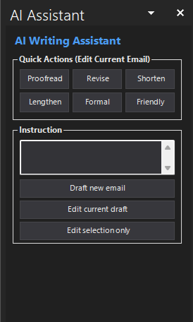

# OutlookAI

> **Inspired by [OutlookAI by kirklandsig](https://github.com/kirklandsig/OutlookAI)** — originally created and released under the MIT License.

An AI-powered email writing assistant for Microsoft Outlook, built as a VSTO add-in. Uses the Claude Code CLI as its AI backend with the Claude Opus 4.6 model, letting you use your existing Claude Pro or Max subscription — no separate API key or per-token billing required.

<p align="center">
  &nbsp;&nbsp;&nbsp;&nbsp;
  
</p>

---

## Table of Contents

- [Features](#features)
  - [Quick Actions](#quick-actions)
  - [Instruction-Based Drafting and Editing](#instruction-based-drafting-and-editing)
  - [Context Awareness](#context-awareness)
  - [Iterative Refinement](#iterative-refinement)
  - [Dark Mode](#dark-mode)
  - [Automatic Updates](#automatic-updates)
  - [Debug Mode](#debug-mode)
- [Limitations](#limitations)
- [Requirements](#requirements)
- [Getting Started](#getting-started)
  - [Claude Code Setup](#claude-code-setup)
  - [Installation](#installation)
  - [Building from Source](#building-from-source)
- [Usage](#usage)
  - [Opening the Assistant](#opening-the-assistant)
  - [Quick Actions](#using-quick-actions)
  - [Drafting a New Email](#drafting-a-new-email)
  - [Editing the Current Draft](#editing-the-current-draft)
  - [Editing a Selection](#editing-a-selection)
  - [Inline Responses](#inline-responses)
- [How It Works](#how-it-works)
- [Troubleshooting](#troubleshooting)
- [License](#license)
- [Acknowledgments](#acknowledgments)

---

## Features

### Quick Actions

Six one-click buttons to transform your email draft instantly:

| Button | What it does |
|---|---|
| **Proofread** | Fix spelling, grammar, and punctuation errors. Keeps tone, meaning, and structure unchanged. |
| **Revise** | Improve clarity, flow, and word choice. Preserves original meaning and tone. |
| **Shorten** | Make the email more concise. Removes filler and redundancy while keeping all key points. |
| **Lengthen** | Expand with more detail, context, or explanation. Keeps the same tone and intent. |
| **Formal** | Rewrite in a more formal, professional tone. Keeps the same content and meaning. |
| **Friendly** | Rewrite in a warmer, more conversational tone. Keeps the same content and meaning. |

### Instruction-Based Drafting and Editing

Three ways to use natural-language instructions:

- **Draft new email** — Describe what you want to write and the AI composes the email from scratch. Clears any previous AI context to start fresh.
- **Edit current draft** — Give the AI an instruction to modify the current draft (e.g., "translate to Spanish", "add bullet points", "make the second paragraph shorter"). Preserves conversation history so you can refine iteratively.
- **Edit selection only** — Highlight specific text in the email editor and give an instruction. Only the selected text is modified; everything else stays exactly as-is.

### Context Awareness

The AI automatically sees the full context of the email you're working on:

- **Current draft** — The text you've written so far (re-read on every action to capture manual edits between AI operations).
- **Email signature** — Detected via Outlook's `_MailAutoSig` bookmark. Provided to the AI for tone matching but excluded from the AI's output, since Outlook inserts signatures automatically.
- **Quoted thread** — Detected via Outlook's `_MailOriginal` bookmark. Provided for context when replying, so the AI can address the content of the conversation. Also excluded from the AI's output.

This means the AI knows what you're replying to, matches your signature's tone, and never duplicates your signature or the quoted thread.

### Iterative Refinement

When using **Edit current draft**, each AI interaction is recorded in an edit history. On subsequent edits, the AI sees all previous turns — what action was taken, what instruction was given, and what the result was. This lets you chain operations naturally:

1. "Draft a thank-you email to Sarah for organizing the offsite"
2. "Make it shorter"
3. "Add a line about the Q3 planning session"
4. "Make the tone more formal"

Each step builds on the last, with full context of the conversation.

### Dark Mode

The task pane automatically matches your Outlook theme:

- Detects the Office theme from the registry (`UI Theme` key under `HKCU\SOFTWARE\Microsoft\Office\16.0\Common`)
- Falls back to the Windows system theme (`AppsUseLightTheme` under `HKCU\SOFTWARE\Microsoft\Windows\CurrentVersion\Themes\Personalize`)
- Applies a full dark color palette to all UI elements — buttons, text fields, labels, borders, status indicators — when dark mode is detected

No manual configuration needed.

### Automatic Updates

The add-in checks for updates automatically:

- Polls the [GitHub Releases](../../releases) page every 10 minutes using the GitHub API
- Uses ETags for conditional requests to minimize API rate limiting
- When a new version is found, downloads the installer to a temp directory
- Installs silently when Outlook closes — no manual download or re-installation needed
- The version label at the bottom of the task pane shows update status: "up to date", "downloading v2.x.x…", or "v2.x.x ready — installs on close"
- Click the "update error" link (if visible) to see error details

### Debug Mode

For troubleshooting, click the version label at the bottom of the task pane 7 times to enable debug mode. Once enabled:

- Every AI action logs detailed state to the clipboard: Word document boundaries, bookmark positions, draft/signature/thread text, and Claude's response
- Logs are timestamped and auto-copied after each operation
- The version label shows "Debug enabled"

---

## Limitations

OutlookAI is focused on email composition assistance. The following are **not** supported:

- **No model selection** — Hard-coded to Claude Opus 4.6. There is no UI to choose a different model.
- **No request cancellation** — Once an action is submitted, it runs until completion or times out after 2 minutes. There is no cancel button.
- **No settings or configuration UI** — No preferences panel. All behavior is built-in.
- **No preview before applying** — AI results are written directly into the email draft. There is no intermediate preview/accept/reject step.
- **No undo** — Standard Ctrl+Z in the Outlook editor may work for simple cases, but there is no dedicated undo for AI operations.
- **No saved prompts or templates** — Instructions must be typed each time.
- **No reading or summarizing received emails** — The assistant only works in compose mode (new, reply, forward). It cannot process emails you are reading.
- **No attachment awareness** — The AI does not see or reference email attachments.
- **No HTML or rich-text formatting control** — The AI returns plain text. Formatting is handled by Outlook's editor.
- **No Outlook for Mac, Outlook on the web, or new Outlook** — Only classic desktop Outlook (2016, 2019, 2021, 2024) on Windows is supported.
- **No keyboard shortcuts** — All actions require clicking buttons in the task pane.
- **No offline mode** — Requires an internet connection and an active Claude subscription.

---

## Requirements

| Requirement | Details |
|---|---|
| **OS** | Windows 10 or 11 (also Windows Server 2019/2022/2025) |
| **Outlook** | Microsoft Outlook 2016, 2019, 2021, or 2024 — classic desktop version only |
| **Runtime** | .NET Framework 4.8 |
| **VSTO Runtime** | [Visual Studio Tools for Office Runtime](https://aka.ms/VSTORuntime) (installed automatically by the setup) |
| **Claude Code CLI** | [Install instructions](https://docs.anthropic.com/en/docs/claude-code/overview) — requires a Claude Pro or Max subscription |
| **Node.js** | Required by Claude Code CLI |

---

## Getting Started

### Claude Code Setup

1. Install Node.js from [nodejs.org](https://nodejs.org) if you don't have it
2. Install Claude Code CLI:
   ```
   npm install -g @anthropic-ai/claude-code
   ```
3. Authenticate with your Claude subscription:
   ```
   claude auth login
   ```
4. Verify it works:
   ```
   claude -p "Hello"
   ```
   This should print a response. If it does, you're ready to install the add-in.

### Installation

1. Download the latest `.exe` installer from [GitHub Releases](../../releases/latest)
2. Run the installer — it requires no admin privileges and installs to your local AppData
3. Open Outlook — the AI Assistant button appears in the ribbon on compose windows

The installer handles VSTO registration automatically. If a previous version is installed, it is uninstalled first to prevent conflicts.

### Building from Source

**Prerequisites:**
- Visual Studio 2022
- Office/SharePoint development workload
- .NET desktop development workload

**Steps:**
1. Clone this repository
2. Open `OutlookAI.csproj` in Visual Studio
3. Restore NuGet packages
4. Build > Rebuild Solution

The project uses ClickOnce publishing with an Inno Setup wrapper for distribution. The build pipeline (`.github/workflows/build.yml`) runs automatically on every push to master. Releases are created on demand via the release workflow.

---

## Usage

### Opening the Assistant

1. Open Outlook and start composing an email (New, Reply, or Forward)
2. Click the **AI Assistant** toggle button in the ribbon — the task pane opens on the right side
3. Click the button again to hide the pane

The task pane automatically appears when you open a compose window. It resets its state (clears instructions, edit history, and cached context) each time you start a new email.

### Using Quick Actions

1. Write your email draft in the Outlook editor
2. Click any Quick Action button (Proofread, Revise, Shorten, Lengthen, Formal, or Friendly)
3. The AI reads your current draft, processes it, and replaces the draft text with the result
4. Your signature and quoted thread are preserved automatically

### Drafting a New Email

1. Type your instructions in the text box (e.g., "Write a thank-you email to John for the meeting yesterday")
2. Click **Draft new email**
3. The AI composes the email from scratch based on your instructions
4. If you're replying or forwarding, the AI sees the quoted thread for context

### Editing the Current Draft

1. Type an instruction in the text box (e.g., "Make it shorter", "Add a paragraph about the budget")
2. Click **Edit current draft**
3. The AI modifies the draft according to your instruction
4. Repeat as many times as needed — each edit builds on the conversation history

### Editing a Selection

1. Highlight specific text in the Outlook email editor
2. Type an instruction in the text box (e.g., "Make this more formal", "Translate to French")
3. Click **Edit selection only**
4. Only the selected text is modified; everything else remains unchanged

### Inline Responses

The assistant works with Outlook's inline response feature (replying directly from the reading pane):

- The **AI Assistant** button appears in the inline response ribbon
- The task pane opens within the Explorer window
- All features (quick actions, drafting, editing, selection editing) work identically
- The pane automatically hides when you close the inline response

---

## How It Works

OutlookAI invokes the Claude Code CLI (`claude`) as a subprocess. Several integration approaches were evaluated:

| Approach | Tradeoff |
|---|---|
| Persistent subprocess with NDJSON protocol | Eliminates startup latency but requires ~150 lines of protocol handling, process lifecycle management, and crash recovery |
| Claude Agent SDK via HTTP bridge | Same latency benefit, but adds a Node.js middleman process, ~150 MB of deployment overhead, and an extra IPC hop |
| MCP server mode (`claude mcp serve`) | Designed for tool integration, not prompt-response — adds ~300 lines of JSON-RPC client code for no benefit in this use case |
| Fire-and-forget subprocess (`claude -p`) | Simple, but pays ~500 ms CLI startup cost on every request |

OutlookAI uses a **pre-warmed fire-and-forget** approach:

1. At Outlook startup, a `claude -p` process is spawned in the background and waits for input
2. When the user triggers an action, the prompt is written to the already-warm process's stdin and the response is read from stdout
3. A new process is immediately pre-warmed in the background for the next request

This gives the zero-latency benefit of a persistent process with the simplicity of fire-and-forget — no protocol implementation, no process lifecycle management, no extra dependencies.

**Technical details:**
- CLI path: `~/.local/bin/claude.exe`
- CLI arguments: `-p - --output-format json --max-turns 1 --model "claude-opus-4-6"`
- Timeout: 2 minutes per request
- Output: JSON response parsed for the `result` field (with `text` field as fallback for older CLI versions)
- The system prompt instructs Claude to return plain text only — no markdown, no HTML, no code fences

---

## Troubleshooting

<details>
<summary><strong>Add-in doesn't appear in the ribbon</strong></summary>

- Restart Outlook
- Check File > Options > Add-ins — look for OutlookAI in the list
- If it's listed under "Disabled Application Add-ins", re-enable it (see next section)
</details>

<details>
<summary><strong>Add-in keeps getting disabled</strong></summary>

Outlook's "Resiliency" feature disables add-ins that load slowly:

1. File > Options > Add-ins
2. At the bottom, change the dropdown to "Disabled Items" and click **Go**
3. Select OutlookAI and click **Enable**
4. Restart Outlook
</details>

<details>
<summary><strong>"Untrusted" or security errors</strong></summary>

Windows may block downloaded files. Unblock all add-in files:

```powershell
Get-ChildItem -Path "$env:LOCALAPPDATA\OutlookAI" -Recurse | Unblock-File
```

Or right-click each file > Properties > check "Unblock".
</details>

<details>
<summary><strong>"Claude Code CLI is not installed" error</strong></summary>

The CLI was not found at `~/.local/bin/claude.exe`.

1. Install Claude Code: `npm install -g @anthropic-ai/claude-code`
2. Restart Outlook after installing (the add-in checks for the CLI at startup)
</details>

<details>
<summary><strong>"Node.js is required" error</strong></summary>

Claude Code CLI requires Node.js to run.

1. Install Node.js from [nodejs.org](https://nodejs.org)
2. Restart your terminal and verify: `node --version`
3. Restart Outlook
</details>

<details>
<summary><strong>"Claude Code is not authenticated" error</strong></summary>

1. Open a terminal and run: `claude auth login`
2. Sign in with your Claude Pro or Max subscription
3. Restart Outlook after authenticating
</details>

<details>
<summary><strong>Requests timing out (2-minute timeout)</strong></summary>

- Check your internet connection
- Verify Claude Code works independently: `claude -p "Hello"`
- Claude may be temporarily overloaded — try again in a moment
- If the issue persists, the pre-warmed process may have stalled; restart Outlook to spawn a fresh one
</details>

<details>
<summary><strong>"Rate limit reached" error</strong></summary>

You've hit Claude's rate limit for your subscription tier. Wait a moment and try again.
</details>

<details>
<summary><strong>Upgrade fails with "another version is currently installed"</strong></summary>

The installer should handle this automatically by unregistering the old VSTO add-in before installing. If it doesn't:

1. Close Outlook
2. Open a terminal as administrator
3. Run: `"%CommonProgramFiles%\microsoft shared\VSTO\10.0\VSTOInstaller.exe" /u /s "<install-path>\OutlookAI.vsto"`
4. Run the new installer
</details>

<details>
<summary><strong>Update check shows an error</strong></summary>

Click the "update error" link at the bottom of the task pane to see the full error message. Common causes:

- No internet connection
- GitHub API rate limiting (the add-in uses ETags to minimize this)
- Firewall blocking `api.github.com`
</details>

---

## License

This project is inspired by [OutlookAI by kirklandsig](https://github.com/kirklandsig/OutlookAI), which is licensed under the [MIT License](https://github.com/kirklandsig/OutlookAI/blob/main/LICENSE).

See the [LICENSE](LICENSE) file for the full license text.

## Acknowledgments

- [kirklandsig/OutlookAI](https://github.com/kirklandsig/OutlookAI) — Original project that inspired this one
- [Claude Code CLI](https://docs.anthropic.com/en/docs/claude-code/overview) — AI backend
