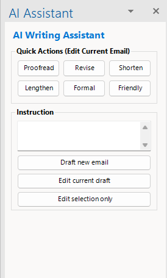

# OutlookAI

> **Inspired by [OutlookAI by kirklandsig](https://github.com/kirklandsig/OutlookAI)** — originally created and released under the MIT License.

An AI-powered email assistant for Microsoft Outlook: a VSTO add-in with an AI writing sidebar for composing mail, plus a local [MCP server](#mcp-server-mail-search-reading-and-drafting-for-ai-agents) that lets AI agents like Claude Code search, read, and draft mail in your mailboxes — fast, local, and cloud-independent. The sidebar uses the Claude Code CLI as its AI backend with the Claude Opus 4.6 model, letting you use your existing Claude Pro or Max subscription — no separate API key or per-token billing required.

<p align="center">
  
  
</p>

---

## Table of Contents

- [Features](#features)
  - [Quick Actions](#quick-actions)
  - [Instruction-Based Drafting and Editing](#instruction-based-drafting-and-editing)
  - [Context Awareness](#context-awareness)
  - [Iterative Refinement](#iterative-refinement)
  - [Outlook Tuning and Settings](#outlook-tuning-and-settings)
  - [Dark Mode](#dark-mode)
  - [Automatic Updates](#automatic-updates)
  - [Debug Mode](#debug-mode)
- [MCP Server (Mail Search, Reading, and Drafting for AI Agents)](#mcp-server-mail-search-reading-and-drafting-for-ai-agents)
  - [Setup and Registration](#setup-and-registration)
  - [Outlook Lifetime and the Tray Icon](#outlook-lifetime-and-the-tray-icon)
- [Limitations](#limitations)
- [Requirements](#requirements)
- [Getting Started](#getting-started)
  - [Claude Code Setup](#claude-code-setup)
  - [Installation](#installation)
  - [Building from Source](#building-from-source)
- [Usage](#usage)
  - [Opening the Assistant](#opening-the-assistant)
  - [Quick Actions](#using-quick-actions)
  - [Drafting a New Email](#drafting-a-new-email)
  - [Editing the Current Draft](#editing-the-current-draft)
  - [Editing a Selection](#editing-a-selection)
  - [Inline Responses](#inline-responses)
- [How It Works](#how-it-works)
- [Troubleshooting](#troubleshooting)
- [License](#license)
- [Acknowledgments](#acknowledgments)

---

## Features

### Quick Actions

One-click buttons to transform your email draft instantly:

| Button | What it does |
|---|---|
| **Proofread** | Fix spelling, grammar, and punctuation errors. Keeps tone, meaning, and structure unchanged. |
| **Revise** | Improve clarity, flow, and word choice. Preserves original meaning and tone. |
| **Shorten** | Make the email more concise. Removes filler and redundancy while keeping all key points. |
| **Lengthen** | Expand with more detail, context, or explanation. Keeps the same tone and intent. |
| **Formal** | Rewrite in a more formal, professional tone. Keeps the same content and meaning. |
| **Friendly** | Rewrite in a warmer, more conversational tone. Keeps the same content and meaning. |
| **Select the best signature** | The AI looks at your draft, the quoted thread, and the recipients, picks the most fitting of your installed Outlook signatures (for example by matching the language), and applies it. Your draft text and the quoted conversation stay untouched. With a single installed signature it is applied directly without an AI call; the button is available only when at least one signature exists. |

### Instruction-Based Drafting and Editing

Three ways to use natural-language instructions:

- **Draft new email** — Describe what you want to write and the AI composes the email from scratch. Clears any previous AI context to start fresh.
- **Edit current draft** — Give the AI an instruction to modify the current draft (e.g., "translate to Spanish", "add bullet points", "make the second paragraph shorter"). Preserves conversation history so you can refine iteratively.
- **Edit selection only** — Highlight specific text in the email editor and give an instruction. Only the selected text is modified; everything else stays exactly as-is.

### Context Awareness

The AI automatically sees the full context of the email you're working on:

- **Current draft** — The text you've written so far (re-read on every action to capture manual edits between AI operations).
- **Email signature** — Detected via Outlook's `_MailAutoSig` bookmark. Provided to the AI for tone matching but excluded from the AI's output, since Outlook inserts signatures automatically.
- **Quoted thread** — Detected via Outlook's `_MailOriginal` bookmark. Provided for context when replying, so the AI can address the content of the conversation. Also excluded from the AI's output.

This means the AI knows what you're replying to, matches your signature's tone, and never duplicates your signature or the quoted thread.

### Iterative Refinement

When using **Edit current draft**, each AI interaction is recorded in an edit history. On subsequent edits, the AI sees all previous turns — what action was taken, what instruction was given, and what the result was. This lets you chain operations naturally:

1. "Draft a thank-you email to Sarah for organizing the offsite"
2. "Make it shorter"
3. "Add a line about the Q3 planning session"
4. "Make the tone more formal"

Each step builds on the last, with full context of the conversation.

### Outlook Tuning and Settings

OutlookAI keeps a proven Outlook configuration applied automatically:

- **Fast local search** — registry settings that route Outlook's search to the local Windows Search index (no server round-trips, no 250-result display cap)
- **Full mailbox caching** — Cached Exchange Mode sync slider set to All (shared folders included), so search covers the whole mailbox
- **OST headroom** — raised local cache size limits so a fully cached mailbox never silently stalls syncing

The tuning service reconciles these on every Outlook start, writes only actual differences, respects (and flags) values enforced by organizational group policy, and tells you when a change still needs an Outlook restart.

An **OutlookAI Settings** button on the main Mail ribbon opens a small dialog (light/dark theme aware) where each tuning group can be toggled on or off and the current effective values are shown. Turning a group off stops managing it and leaves your Outlook settings as they are; uninstalling never reverts your Outlook configuration.

The dialog also carries a **Mail server** status line: whether the [MCP server](#mcp-server-mail-search-reading-and-drafting-for-ai-agents) is registered with Claude Code and which executable that registration points at — or what is standing in the way (Claude Code not found, no server installed alongside the add-in, or the .NET 10 runtime missing, with the download link). **Apply now** re-runs the tuning reconcile *and* the registration check, so something you have just fixed is picked up without restarting Outlook.

### Dark Mode

The task pane automatically matches your Outlook theme:

- Detects the Office theme from the registry (`UI Theme` key under `HKCU\SOFTWARE\Microsoft\Office\16.0\Common`)
- Falls back to the Windows system theme (`AppsUseLightTheme` under `HKCU\SOFTWARE\Microsoft\Windows\CurrentVersion\Themes\Personalize`)
- Applies a full dark color palette to all UI elements — buttons, text fields, labels, borders, status indicators — when dark mode is detected

No manual configuration needed.

### Automatic Updates

The add-in checks for updates automatically:

- Polls the [GitHub Releases](../../releases) page every 10 minutes using the GitHub API
- Uses ETags for conditional requests to minimize API rate limiting
- When a new version is found, downloads the installer to a temp directory
- Installs silently when Outlook closes — no manual download or re-installation needed
- Retries on the next check and on each Outlook restart if an update doesn't complete (no retry limit; only one installer is launched at a time)
- The version label at the bottom of the task pane shows update status: "up to date", "downloading v2.x.x…", or "v2.x.x ready — installs on close"
- Click the "update error" link (if visible) to see error details

The add-in and the [mail server](#mcp-server-mail-search-reading-and-drafting-for-ai-agents) ship in the same installer and carry the same version number, so one update covers both. A silent auto-update deliberately does **not** install missing prerequisites (.NET Framework 4.8, the VSTO runtime, the .NET 10 runtime) — it runs unattended after Outlook closes, and the elevation prompt would sit there unanswered. Prerequisites are installed when you run the installer yourself; until then the add-in reports what is missing in [OutlookAI Settings](#outlook-tuning-and-settings).

### Debug Mode

For troubleshooting, click the version label at the bottom of the task pane 7 times to enable debug mode. Once enabled:

- Every AI action logs detailed state to the clipboard: Word document boundaries, bookmark positions, draft/signature/thread text, and Claude's response
- Logs are timestamped and auto-copied after each operation
- The version label shows "Debug enabled"

---

## MCP Server (Mail Search, Reading, and Drafting for AI Agents)

Alongside the compose sidebar, OutlookAI includes a local **MCP (Model Context Protocol) server** that gives AI agents — Claude Code, or any MCP-capable client — safe, fast access to your mail. It runs entirely on your machine: mail is searched through the local Windows Search index and read through Outlook itself, with no cloud mail API and no data leaving your computer.

What an agent can do with it:

| Capability | Tools |
|---|---|
| **Search** all cached mailboxes (including delegate/shared mailboxes and attachment contents) in milliseconds; search words are matched as whole words, each independently in the subject or the body, and matching can be narrowed to just one of them (`search_in`); results always include mail that arrived seconds ago (a built-in freshness sweep that follows the folder you search, cached briefly so repeated searches stay instant), and an `exhaustive` option scans folders directly when the index is stale | `search`, `thread` |
| **Read** any mail in full (long bodies page in windows without re-reading from the start; sender/recipient details, conversation view), optionally including the stored HTML so the agent can check formatting, signature placement and where the quoted thread begins — all of which the plain-text view hides — and save attachments to disk so the agent can open them | `read`, `save_attachment`, `list_accounts`, `list_folders` |
| **Organize mail** — move mail (up to 50 at a time) to another folder within the same account, creating the target folder on request, or archive it exactly like Outlook's own Archive button: each item goes to its own account's designated Archive folder (resolved per mailbox, localized names included). Every move is audited and reversible — results carry the source folder and old/new ids so any move can be undone — and moving to Deleted Items is refused | `move_mail`, `archive_mail` |
| **Show you things** — open a mail on your screen, jump Outlook to a folder, or run a query in Outlook's own search box so you see the result list | `open_in_outlook`, `goto_folder`, `show_search_results` |
| **Draft for you** — new mail, reply, reply-all, forward: the draft opens on screen with the right account identity, that account's real signature untouched below your text (or a specific signature the agent picks to match the message, e.g. by language), and the agent's text above the quote, ready for *you* to review and press Send. The body is plain text by default or **real HTML** (`body_html`) when the message needs to look like a letter — headings, bold, lists, tables, links and inline styling land as genuine formatting in your message only, with the signature and quoted thread untouched below it; unsafe or unsupported markup is removed or unwrapped and half-finished markup repaired, and whatever changed is reported back. Optional Cc/Bcc (added to whoever Outlook already filled in, with any unrecognized address reported back), a subject override that keeps the reply in its thread, importance and a read-receipt request | `new_draft`, `reply_draft`, `replyall_draft`, `forward_draft`, `list_signatures` |
| **Manage signatures** — create, update, or delete an Outlook signature (all three formats written, missing ones derived) and optionally set it as an account's default; before any update or delete the previous files are automatically backed up under `%LOCALAPPDATA%\OutlookAI\signature-backups` and the backup path is returned | `manage_signature` |
| **Send only with friction** — automatic sending requires an explicit two-step confirmation with a one-time token bound to the exact draft content; the sending account is hard-verified before transport and every step is audit-logged | `send` |
| **Self-diagnose** — one call reports Outlook/index/service state, index freshness per store, audit-log writability, tuning state, and whether Claude Code's registration points at the server that is actually running | `outlook_health` |

Safety properties: the server has **no delete tool and no content-modification tool** for existing mail — the only mail-changing operations are content-preserving MOVES (move/archive), which are fully audited and reversible (results carry the source folder, so any move can be undone by moving back) and refuse Deleted Items as a target; signature management is the one destructive-capable surface and it always backs up the previous signature files before changing or deleting anything; every draft/save/move/archive/send/signature operation writes an audit line to `%LOCALAPPDATA%\OutlookAI\audit.log`; payloads are compact and truncation-flagged so agents iterate with cheap targeted queries instead of bulk-reading your mailbox. The server never closes or restarts Outlook (it can start it when needed).

Developer documentation (architecture, test tiers, contributor facts): [`McpServer/README.md`](McpServer/README.md).

### Setup and Registration

**The server ships with the add-in.** The installer places it next to the add-in at `%LOCALAPPDATA%\OutlookAI\Setup\McpServer\OutlookAI.McpServer.exe`. There is nothing to build, copy, or register by hand.

**Prerequisite — the .NET 10 runtime.** The server is a framework-dependent .NET 10 application and needs the *base* .NET runtime (`Microsoft.NETCore.App` 10.x; **not** the Desktop runtime — the server uses no WinForms or WPF). The installer detects it and downloads/installs it on demand, exactly as it already does for .NET Framework 4.8 and the VSTO runtime, and only on an **interactive** install (see [Automatic Updates](#automatic-updates) for why a silent auto-update skips prerequisites). The add-in itself never needs it — if the runtime is missing, the compose sidebar keeps working and only the mail server is unavailable. The add-in says so in [OutlookAI Settings](#outlook-tuning-and-settings) and names the download page: <https://dotnet.microsoft.com/download/dotnet/10.0>. Install it, restart Outlook, and the registration completes itself.

**Registration keeps itself correct.** The server speaks MCP over stdio, and on every Outlook start the add-in reconciles Claude Code's user-global configuration (`~/.claude.json`) so that `mcpServers.outlookai.command` names the installed server. That heals drift on its own — a stale entry left over from an earlier install path, for example. Running `claude mcp add` by hand is no longer needed.

The reconcile is deliberately conservative with a file it does not own:

- a configuration it cannot parse is never rewritten — it is reported instead
- only the `mcpServers` value is re-rendered; every other byte of the file is spliced through unchanged, so no unrelated setting is reformatted or reordered, and other MCP servers stay exactly as they were
- the replacement is atomic and keeps the previous file as `~/.claude.json.outlookai-backup`
- an entry that is already correct writes nothing at all

It also stands down and reports instead of guessing: when Claude Code is not installed on the machine, when there is no server next to the add-in (the developer case below), or when the .NET 10 runtime is missing.

**Where the state is reported** — two places:

- the **Mail server** line in the [OutlookAI Settings](#outlook-tuning-and-settings) dialog, in plain language, with **Apply now** to re-check
- the `registration` block of the `outlook_health` tool, for an agent: `status` (`ok` / `drifted` / `absent` / `unreadable` / `unknown`), `runningFrom`, `registeredCommand`, plus what the add-in last recorded (`addInStatus`, `addInHealed`, `addInLastReconcileUtc`, `addInResolvedServerPath`). The status is computed by comparing the registered command against the executable the server is actually running from, so drift is visible even when the add-in has never reconciled. `outlook_health` only ever reports on the file — repairing it is the add-in's job.

**Updates and running server processes.** Claude Code spawns one server process per agent session, so several are typically running when an update lands. The installer stops the instances running from the install directory before it replaces any file — matched by executable path, so a build running from a source tree is left alone. A session whose server was stopped simply spawns a fresh one on its next mail call; nothing is persisted in the server process, so nothing is lost.

**Developer setup (secondary path)** — building the server from source and pointing Claude Code at the build output still works and is what contributors do. It needs the .NET 10 SDK:

```
dotnet build McpServer/OutlookAI.McpServer/OutlookAI.McpServer.csproj -c Release
claude mcp add --scope user outlookai <repo>\McpServer\OutlookAI.McpServer\bin\Release\net10.0-windows\OutlookAI.McpServer.exe
```

A developer add-in build has no server installed beside it, so the reconcile recognizes that case and leaves such a registration alone. If an installed OutlookAI is also present, it *will* take the registration over on the next Outlook start — that is the drift healing doing its job, and re-running the command above points it back at your build.

### Outlook Lifetime and the Tray Icon

When an agent needs Outlook and it is not running, the server starts it **headless**: no window appears — just an Outlook icon in the system tray whose tooltip reads *"Another program is using Outlook. To disconnect programs and exit Outlook, click the Outlook icon and then click Exit Now."* This is normal Outlook behavior for a programmatically started instance, and it is by design the server's preferred state: a headless Outlook syncs mail and feeds the Windows Search index like a normal one, without being in your way.

How the lifetime behaves (measured on a current classic Outlook build):

- **While any agent session is connected**, the headless Outlook keeps running. Server processes are per-agent-session and release their connection when the session ends.
- **After the last connection is released**, a headless Outlook keeps running for roughly **10-12 minutes** and then exits on its own. The tray tooltip may still show the "another program" message during that grace period even though nothing is connected anymore.
- **Want a normal Outlook?** Just launch Outlook the usual way — the *same* headless process promotes itself to a full windowed session within a couple of seconds (watch the taskbar rather than the tray). No conflict, nothing to close first.
- **Closing the window** (yours or a promoted one) exits Outlook within seconds — even while agent sessions are still connected. Outlook has deliberately not let external programs keep it alive after a user closes it since Outlook 2007 SP2. The server simply reconnects — and restarts Outlook headless — the next time an agent needs mail access.
- **Exit Now** on the tray icon force-disconnects clients and exits the headless Outlook immediately; agents likewise reconnect on demand later.
- The server itself **never closes or restarts Outlook** under any circumstances.

One rule for other automation on the machine: do not drive `Application.Quit()` while agent sessions are attached — Outlook then tears down and parks indefinitely, waiting for the attached clients (that is what the tray tooltip is warning about). The parked state resolves itself a few seconds after the attached sessions release (for agent sessions: when they end). Prefer closing Outlook's window, or stop the agent sessions first.

---

## Limitations

The compose sidebar is focused on email composition assistance. The following are **not** supported there:

- **No model selection** — Hard-coded to Claude Opus 4.6. There is no UI to choose a different model.
- **No request cancellation** — Once an action is submitted, it runs until completion or times out after 2 minutes. There is no cancel button.
- **No AI preferences UI** — The [Settings dialog](#outlook-tuning-and-settings) covers Outlook tuning only; the AI behavior itself is built-in.
- **No preview before applying** — AI results are written directly into the email draft. There is no intermediate preview/accept/reject step.
- **No undo** — Standard Ctrl+Z in the Outlook editor may work for simple cases, but there is no dedicated undo for AI operations.
- **No saved prompts or templates** — Instructions must be typed each time.
- **No reading or summarizing received emails in the sidebar** — The sidebar only works in compose mode (new, reply, forward). Reading, searching, and summarizing received mail is what the [MCP server](#mcp-server-mail-search-reading-and-drafting-for-ai-agents) provides, through an agent like Claude Code.
- **No attachment awareness in the sidebar** — The sidebar AI does not see email attachments (agents can read them via the MCP server's `save_attachment`).
- **No HTML or rich-text formatting control** — The AI returns plain text. Formatting is handled by Outlook's editor.
- **No Outlook for Mac, Outlook on the web, or new Outlook** — Only classic desktop Outlook (2016, 2019, 2021, 2024) on Windows is supported.
- **No keyboard shortcuts** — All actions require clicking buttons in the task pane.
- **No offline mode** — Requires an internet connection and an active Claude subscription.

---

## Requirements

| Requirement | Details |
|---|---|
| **OS** | Windows 10 or 11 (also Windows Server 2019/2022/2025) |
| **Outlook** | Microsoft Outlook 2016 or later (2016, 2019, 2021, 2024) — classic desktop version only. Outlook 2016 is the minimum supported version. |
| **Runtime** | .NET Framework 4.8 |
| **VSTO Runtime** | [Visual Studio Tools for Office Runtime](https://aka.ms/VSTORuntimeDownload) (downloaded and installed automatically if missing — requires admin elevation) |
| **.NET 10 Runtime** | Base runtime only (`Microsoft.NETCore.App` 10.x — [download](https://dotnet.microsoft.com/download/dotnet/10.0)), required by the [mail server](#mcp-server-mail-search-reading-and-drafting-for-ai-agents), not by the add-in. Downloaded and installed automatically when you run the installer yourself (requires admin elevation). |
| **Claude Code CLI** | [Install instructions](https://docs.anthropic.com/en/docs/claude-code/overview) — requires a Claude Pro or Max subscription |
| **Node.js** | Required by Claude Code CLI |

---

## Getting Started

### Claude Code Setup

1. Install Node.js from [nodejs.org](https://nodejs.org) if you don't have it
2. Install Claude Code CLI:
   ```
   npm install -g @anthropic-ai/claude-code
   ```
3. Authenticate with your Claude subscription:
   ```
   claude auth login
   ```
4. Verify it works:
   ```
   claude -p "Hello"
   ```
   This should print a response. If it does, you're ready to install the add-in.

### Installation

1. Download the latest `.exe` installer from [GitHub Releases](../../releases/latest)
2. Run the installer — it installs to your local AppData with no admin privileges required
3. If .NET Framework 4.8, the VSTO Runtime, or the .NET 10 Runtime is missing, the installer downloads and installs it automatically (admin elevation is prompted only for these system-level prerequisites)
4. Open Outlook — the AI Assistant button appears in the ribbon on compose windows
5. Nothing else to do for the [mail server](#mcp-server-mail-search-reading-and-drafting-for-ai-agents): it is installed alongside the add-in, and the add-in registers it with Claude Code on that first Outlook start. Check the **Mail server** line in [OutlookAI Settings](#outlook-tuning-and-settings) if you want to confirm.

The installer registers the add-in directly via the Windows registry and installs the signing certificate to your Trusted Publishers store. Everything lands under `%LOCALAPPDATA%\OutlookAI\Setup` — the add-in at the top level, the mail server in the `McpServer` subfolder — and no admin rights are needed for the install itself. To uninstall, use Add/Remove Programs.

### Building from Source

**Prerequisites:**
- Visual Studio 2022
- Office/SharePoint development workload
- .NET desktop development workload
- .NET 10 SDK (for the mail server only)

**Steps:**
1. Clone this repository
2. Open `OutlookAI.csproj` in Visual Studio
3. Restore NuGet packages
4. Build > Rebuild Solution

The project uses MSBuild to generate VSTO manifests and Inno Setup for the installer. Releases are created on demand via the release workflow (`gh workflow run release`).

The mail server is a separate .NET 10 project built with `dotnet`, not through the Visual Studio solution — see [`McpServer/README.md`](McpServer/README.md) for its build, test, and registration instructions. The release workflow publishes it (framework-dependent, win-x64) into the installer payload and stamps it with the **same version as the add-in**, so one release produces one version across the whole product; local developer builds of both carry `99.99.99.0`, which is also the marker the auto-updater uses to leave a developer build alone.

---

## Usage

### Opening the Assistant

1. Open Outlook and start composing an email (New, Reply, or Forward)
2. Click the **AI Assistant** toggle button in the ribbon — the task pane opens on the right side
3. Click the button again to hide the pane

The task pane automatically appears when you open a compose window. It resets its state (clears instructions, edit history, and cached context) each time you start a new email.

### Using Quick Actions

1. Write your email draft in the Outlook editor
2. Click any Quick Action button (Proofread, Revise, Shorten, Lengthen, Formal, or Friendly)
3. The AI reads your current draft, processes it, and replaces the draft text with the result
4. Your signature and quoted thread are preserved automatically

### Drafting a New Email

1. Type your instructions in the text box (e.g., "Write a thank-you email to John for the meeting yesterday")
2. Click **Draft new email**
3. The AI composes the email from scratch based on your instructions
4. If you're replying or forwarding, the AI sees the quoted thread for context

### Editing the Current Draft

1. Type an instruction in the text box (e.g., "Make it shorter", "Add a paragraph about the budget")
2. Click **Edit current draft**
3. The AI modifies the draft according to your instruction
4. Repeat as many times as needed — each edit builds on the conversation history

### Editing a Selection

1. Highlight specific text in the Outlook email editor
2. Type an instruction in the text box (e.g., "Make this more formal", "Translate to French")
3. Click **Edit selection only**
4. Only the selected text is modified; everything else remains unchanged

### Inline Responses

The assistant works with Outlook's inline response feature (replying directly from the reading pane):

- The **AI Assistant** button appears in the inline response ribbon
- The task pane opens within the Explorer window
- All features (quick actions, drafting, editing, selection editing) work identically
- The pane automatically hides when you close the inline response

---

## How It Works

OutlookAI invokes the Claude Code CLI (`claude`) as a subprocess. Several integration approaches were evaluated:

| Approach | Tradeoff |
|---|---|
| Persistent subprocess with NDJSON protocol | Eliminates startup latency but requires ~150 lines of protocol handling, process lifecycle management, and crash recovery |
| Claude Agent SDK via HTTP bridge | Same latency benefit, but adds a Node.js middleman process, ~150 MB of deployment overhead, and an extra IPC hop |
| MCP server mode (`claude mcp serve`) | Designed for tool integration, not prompt-response — adds ~300 lines of JSON-RPC client code for no benefit in this use case |
| Fire-and-forget subprocess (`claude -p`) | Simple, but pays ~500 ms CLI startup cost on every request |

OutlookAI uses a **pre-warmed fire-and-forget** approach:

1. At Outlook startup, a `claude -p` process is spawned in the background and waits for input
2. When the user triggers an action, the prompt is written to the already-warm process's stdin and the response is read from stdout
3. A new process is immediately pre-warmed in the background for the next request

This gives the zero-latency benefit of a persistent process with the simplicity of fire-and-forget — no protocol implementation, no process lifecycle management, no extra dependencies.

**Technical details:**
- CLI path: `~/.local/bin/claude.exe`
- CLI arguments: `-p - --output-format json --max-turns 1 --model "claude-opus-4-6"`
- Timeout: 2 minutes per request
- Output: JSON response parsed for the `result` field (with `text` field as fallback for older CLI versions)
- The system prompt instructs Claude to return plain text only — no markdown, no HTML, no code fences

---

## Troubleshooting

<details>
<summary><strong>Add-in doesn't appear in the ribbon</strong></summary>

- Restart Outlook
- Check File > Options > Add-ins — look for OutlookAI in the list
- If it's listed under "Disabled Application Add-ins", re-enable it (see next section)
</details>

<details>
<summary><strong>Add-in keeps getting disabled</strong></summary>

The installer sets a `DoNotDisableAddinList` registry key to prevent Outlook from disabling the add-in. If it was disabled before installing the latest version, reinstalling should clear it. If the issue persists:

1. File > Options > Add-ins
2. At the bottom, change the dropdown to "Disabled Items" and click **Go**
3. Select OutlookAI and click **Enable**
4. Restart Outlook
</details>

<details>
<summary><strong>"Untrusted" or security errors</strong></summary>

The installer automatically adds the signing certificate to your Trusted Publishers store. If you still see trust errors:

1. Run the certificate install manually:
   ```
   certutil -f -user -addstore TrustedPublisher "%LOCALAPPDATA%\OutlookAI\Setup\OutlookAI.cer"
   ```
2. If files are blocked by Windows SmartScreen, unblock them:
   ```powershell
   Get-ChildItem -Path "$env:LOCALAPPDATA\OutlookAI\Setup" -Recurse | Unblock-File
   ```
3. Restart Outlook
</details>

<details>
<summary><strong>"Claude Code CLI is not installed" error</strong></summary>

The CLI was not found at `~/.local/bin/claude.exe`.

1. Install Claude Code: `npm install -g @anthropic-ai/claude-code`
2. Restart Outlook
</details>

<details>
<summary><strong>"Node.js is required" error</strong></summary>

Claude Code CLI requires Node.js to run.

1. Install Node.js from [nodejs.org](https://nodejs.org)
2. Restart your terminal and verify: `node --version`
3. Restart Outlook
</details>

<details>
<summary><strong>"Claude Code is not authenticated" error</strong></summary>

1. Open a terminal and run: `claude auth login`
2. Sign in with your Claude Pro or Max subscription
3. Restart Outlook
</details>

<details>
<summary><strong>The mail tools aren't available to my agent</strong></summary>

Open **OutlookAI Settings** on the Mail ribbon and read the **Mail server** line — it names the actual cause:

- *"needs the .NET 10 runtime"* — install the base runtime from [dotnet.microsoft.com](https://dotnet.microsoft.com/download/dotnet/10.0) and restart Outlook. This is the usual outcome after a silent auto-update, which does not install prerequisites.
- *"Claude Code was not found"* — install the Claude Code CLI (see [Claude Code Setup](#claude-code-setup)) and restart Outlook.
- *"not installed alongside the add-in"* — you are running a developer build of the add-in; register a built server yourself (see [Setup and Registration](#setup-and-registration)).
- *"Claude Code's configuration could not be read"* — `~/.claude.json` is not valid JSON. The add-in deliberately refuses to rewrite a file it cannot parse. Fix or restore the file, then press **Apply now**.

Then start a fresh agent session — Claude Code reads its MCP configuration at session start, so an already-running session will not pick up a repaired registration. Asking the agent to run `outlook_health` reports the same state from the server's side, including whether the registration points at the executable it is actually running from.
</details>

<details>
<summary><strong>Requests timing out (2-minute timeout)</strong></summary>

- Check your internet connection
- Verify Claude Code works independently: `claude -p "Hello"`
- Claude may be temporarily overloaded — try again in a moment
- If the issue persists, the pre-warmed process may have stalled; restart Outlook to spawn a fresh one
</details>

<details>
<summary><strong>"Rate limit reached" error</strong></summary>

You've hit Claude's rate limit for your subscription tier. Wait a moment and try again.
</details>

<details>
<summary><strong>Upgrade fails or add-in doesn't update</strong></summary>

The installer overwrites files and re-registers the add-in on every run. It also stops any mail server processes running from the install directory before replacing files, so an active agent session does not block an upgrade. If an upgrade seems stuck:

1. Close Outlook
2. Delete the install directory: `%LOCALAPPDATA%\OutlookAI\Setup`
3. Delete the registry key: `HKCU\Software\Microsoft\Office\Outlook\Addins\OutlookAI`
4. Run the installer again
</details>

<details>
<summary><strong>Update check shows an error</strong></summary>

Click the "update error" link at the bottom of the task pane to see the full error message. Common causes:

- No internet connection
- GitHub API rate limiting (the add-in uses ETags to minimize this)
- Firewall blocking `api.github.com`
</details>

---

## License

This project is inspired by [OutlookAI by kirklandsig](https://github.com/kirklandsig/OutlookAI), which is licensed under the [MIT License](https://github.com/kirklandsig/OutlookAI/blob/main/LICENSE).

See the [LICENSE](LICENSE) file for the full license text.

## Acknowledgments

- [kirklandsig/OutlookAI](https://github.com/kirklandsig/OutlookAI) — Original project that inspired this one
- [Claude Code CLI](https://docs.anthropic.com/en/docs/claude-code/overview) — AI backend
